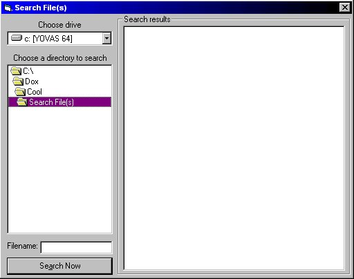



## sEARCH IN SUBDIRECTORIES UPDATED \!\!\!\!\!MUST SEE

### Description

The update of my code now lets you search in drives and now the seacrh is more perfect WITHOUT API'S!!! Is perfect to a mp3 player to catch the files in one specific folder that contains subdirectories and PLEASE VOTE FOR THIS JOB IF YOU LIKE IT!!!
 
### More Info
 

             |
---                |---
**Submitted On**   |2000-07-30 23:16:32
**By**             |[Geovany Andres Villegas](https://github.com/Planet-Source-Code/PSCIndex/blob/master/ByAuthor/geovany-andres-villegas.md)
**Level**          |Intermediate
**User Rating**    |4.8 (19 globes from 4 users)
**Compatibility**  |VB 4\.0 \(32\-bit\), VB 5\.0, VB 6\.0
**Category**       |[Miscellaneous](https://github.com/Planet-Source-Code/PSCIndex/blob/master/ByCategory/miscellaneous__1-1.md)
**World**          |[Visual Basic](https://github.com/Planet-Source-Code/PSCIndex/blob/master/ByWorld/visual-basic.md)
**Archive File**   |[CODE\_UPLOAD84137312000\.zip](https://github.com/Planet-Source-Code/geovany-andres-villegas-search-in-subdirectories-updated-must-see__1-10235/archive/master.zip)

